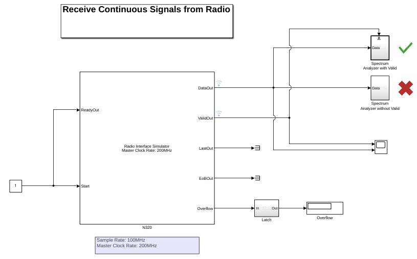
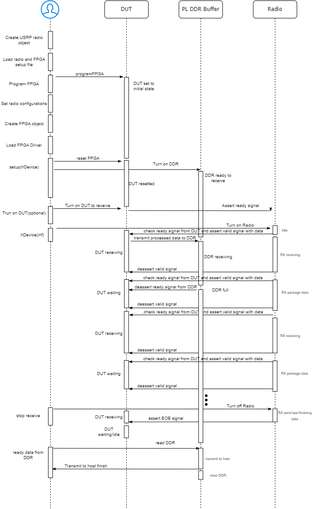
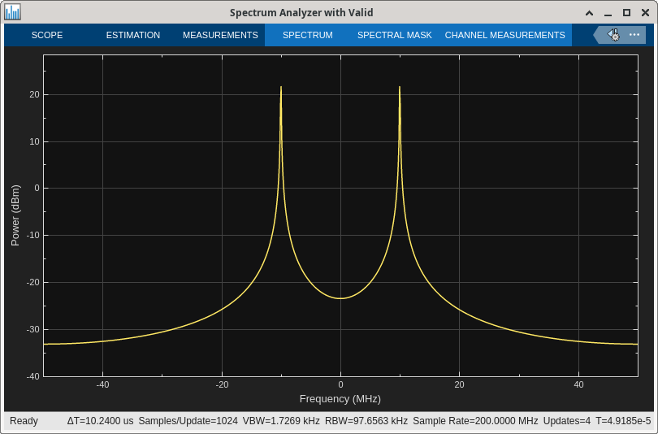
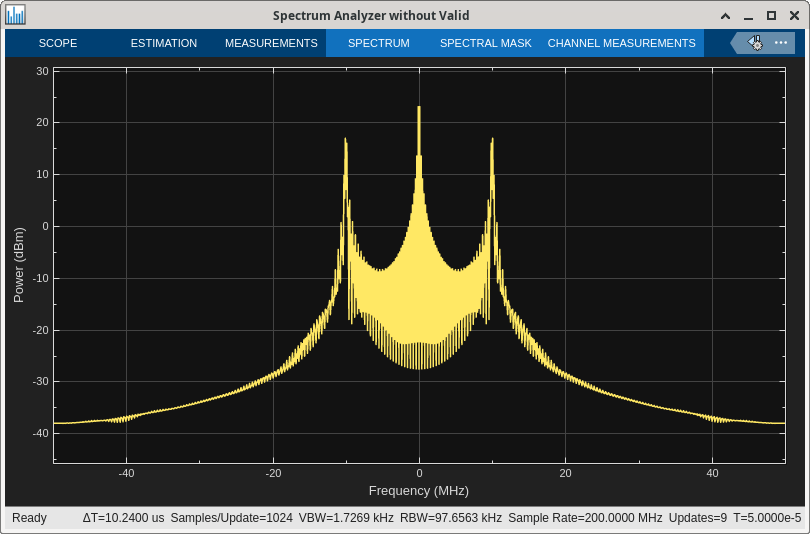
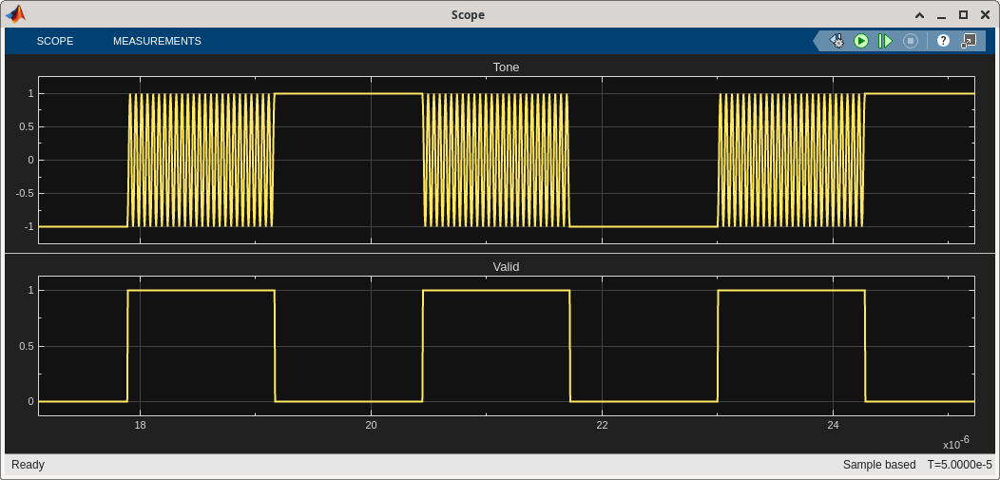
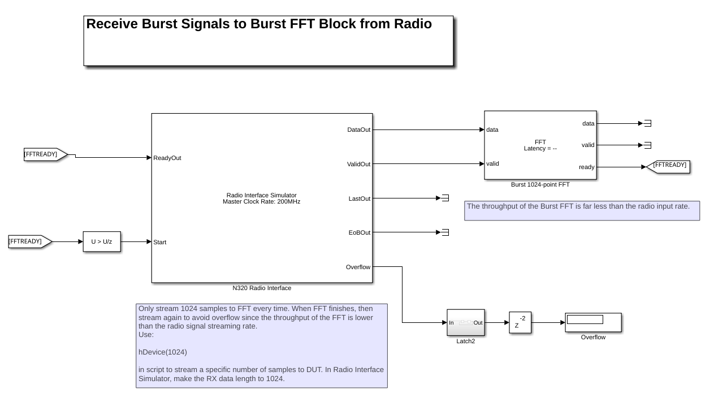
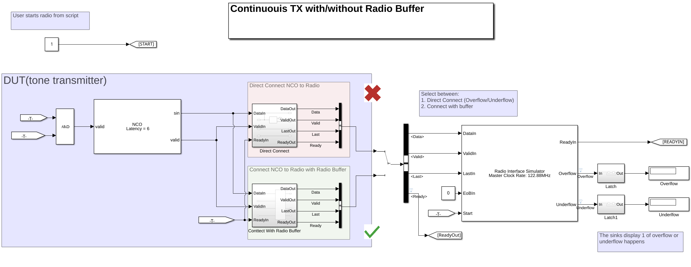
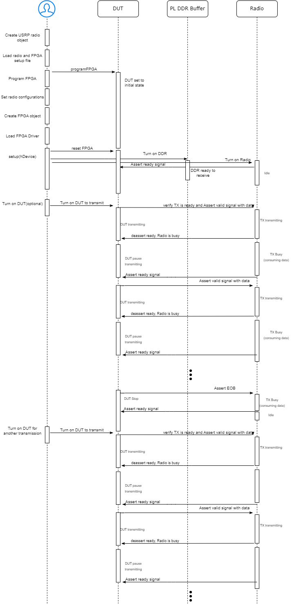
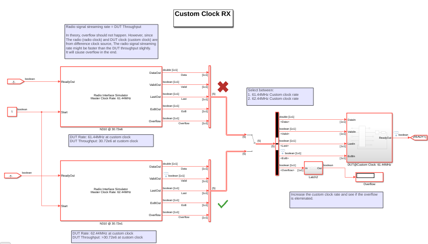

# NI™ USRP™ Radio Interface Simulation

This project demonstrates how to use the **Radio Interface Simulator** block in Simulink® to verify that your Device Under Test (DUT) communicates correctly with a radio interface using a simplified AXI protocol.

## 📘 Overview

The **Radio Interface Simulator** block helps validate that the DUT's input/output behavior aligns with the expected communication protocol of a USRP radio interface. It includes three example models that illustrate how to integrate the Radio Interface Simulator block in different scenarios.

## 🧩 Radio Interface Simulator

The **Radio Interface Simulator** block is a Simulink component that emulates the behavior of a USRP radio interface. It allows you to:

- Simulate **data transmission and reception** between a DUT and a radio.
- Configure **device type** and **sample rate** to match real-world radio settings.
- Detect **protocol violations** such as underflow and overflow.
- Simulate **custom clock rates** and **random clock uncertainty** to test DUT robustness.

This block is central to all models in this project and is used to validate whether the DUT adheres to the expected AXI-based communication protocol.

## 📂 Included Models

### 1. `GetStartModel.slx`

This model introduces the data streaming pattern as a receiver of the Radio Interface Simulator block. In this example:

- The Radio Interface Simulator acts as a **receiver**, sending data to spectrum analyzer.
- The data are streaming from radio interface in chunks
- Respect the valid signal is important to get correct input data from radio.
- You can configure the **device type** and **sample rate** directly from the block parameters.
- Different settings will affect the **duty cycle** of the incoming data stream.

This model is ideal for getting started with the Radio Interface Simulator and understanding how device and sample rate settings impact data flow pattern. The model is shown below:

{width=70%}

The system diagram of DUT receiver is shown below:

{width=70%}

#### Instructions
In this model, the Radio Interface Simulator streams data to two different spectrum analyzers. The top analyzer respects the valid signal, meaning it is only enabled when the valid signal is high. The bottom analyzer ignores the valid signal and remains enabled throughout the simulation. The Radio Interface Simulator is configured to transmit a tone signal.

Run the model and open the spectrum analyzers to compare the results.

The output from the top spectrum analyzer displays a clean and well-defined spectrum of the tone signal, which aligns closely with the expected results from the receiver.

{width=40%}

However, the output from the bottom spectrum analyzer reveals a spectrum with significant noise. This is because the valid signal is not honored, allowing invalid data to be included in the analysis. As a result, the spectrum appears distorted and does not accurately represent the tone signal.

{width=40%}

Open the scope to view the data streaming pattern

{width=40%}

The data are streaming to DUT as data chunks. Lower the sample rate, lwer the duty cycle between each chunk of data. However, in each data chunk, the data rate keeps same as the MCR(Master Clock Rate)

- Change the sample rate to 61.44MHz.
- Run the model and observe that the othe duty cycle change

### 2. `BurstRxModel.slx`
This model demonstrates how to receive a burst signal from a radio over a specific number of samples. The signal is received at the Master Clock Rate (MCR) and passed to a burst FFT block, which does not support continuous streaming. By adjusting the number of samples in the received signal, overflow into the burst FFT can be avoided, ensuring accurate processing of the burst data.

{width=70%}

#### Instructions
- Open  model
- To simulate continuous transmission, the number of input samples is set to 1e8, generating a long signal stream. This configuration helps simulate a continuous receive.
- The start input port of the Radio Interface Simulator is used to trigger data streaming from the radio.
- Assuming when *hDevice(inf)* is executed in the script, the *start* input port of the Radio Interface Simulator is asserted, causing the radio to begin streaming data continuously to the DUT.
- Observe the overflow from scope (That's because the burst FFT does not accept continouse data while it busy)
- Set the number of input data samples to 1024, which corresponds to the FFT length—the maximum number of samples the burst FFT can accept at a time.
- In the script, change the input variable in *hDevice* functiom from *inf* to *1024*.
- Assuming when *hDevice(1024)* is excuted, a fixed number of 1024 samples of data is streamed to the burst FFT.
- When the burst FFT is free, stream another 1024 samples of data to burst FFT again.
- In real design, you need to check the status of the burst FFT and decide whether to run *hDevice(1024)* to stream data to burst by yourself
- Obvserve the overlfow is elimiated.

### 3. `ContinunousTXModel.slx`

This model demonstrates how a **radio buffer** can be used to compensate for pipeline delays in a transmitter. It includes two subsystems:

- **Without Radio Buffer**: A simple NCO-based transmitter without buffering. When connected to the Radio Interface Simulator, this setup may cause **underflow or overflow**, indicating protocol violations and potential data corruption.
- **With Radio Buffer**: The same transmitter with a buffering mechanism. This setup ensures smooth data flow and no protocol violations, as verified by the Radio Interface Simulator.

By toggling between these two subsystems, users can observe the impact of buffering on protocol compliance.The model is shown below:

{width=70%}

The system diagram of DUT trasnmitter is shown below:

{width=70%}

#### Instructions
In this model, an NCO (Numerically Controlled Oscillator) is connected to a Radio Interface Simulator to simulate a tone signal transmitter. If the NCO is directly connected to the radio, which requires valid and ready signals to comply with the AXI-Stream protocol, the connection will fail. This is because the NCO introduces a 6-clock-cycle delay between receiving a valid input signal and producing an output. To maintain proper AXI-Stream handshaking, users must implement a buffer to compensate for this delay and ensure the protocol is respected.
- Open model
- Select the switch to direct connect and run simulation. Observe the overflow and underflow happens
- Select the switch to connect with buffer and run simulation. Observe the overflow and underflow are elimiated since the implementaion of radio buffer.

### 4. `SimulateWithCustomClock.slx`

This model demonstrates how to simulate your DUT with a **custom clock rate** using the Radio Interface Simulator. It also allows you to:

- Introduce **random clock uncertainty** between the custom DUT clock and the radio clock.
- Evaluate how timing mismatches and jitter affect data communication and protocol compliance.

This setup is useful for testing DUT robustness under non-ideal clocking conditions.
{width=70%}

#### Instructions
In this model, the radio interface is configured as a receiver at custom clock rate to receive signal at a sample rate of 30.72MHz. The duty cycle of the DUT is 1/2. If the custom clock and radio clock clock are perfectly synchronized in theory, the system will be free from overflow, since:

RadioSampleRate(30.72MHz) = CustomClockRate(61.44MHz) * DutyCycle(1/2)

However, since clock uncertainty, the slightly difference between radio rample rate and custom clock rate might cause overflow to receiver. To avoid the issue, you can slightly increase the custom clock rate the make it larger than the radio sample rate divided by duty cycle to avoid overflow.
- Open model
- Select the switch to device run at 61.44MHz and run simulation. Observe the overflow happens
- Select the switch to device run at 62.44MHz and run simulation. Observe the overflow elimiated since the higher thoughput of the DUT.

## 🛠 Requirements

- MATLAB® R2026a or later
- Simulink
- Wireless Testbench Toolbox
- DSP HDL Toolbox™

## 🚀 Getting Started

1. Open MATLAB and navigate to the project folder.
2. Open one of the models (e.g., `GetStartWithRadioInterfaceSimulator.slx`).
3. Run the simulation.
4. Observe the behavior of the Radio Interface Simulator block to verify protocol compliance.

## 📈 Use Cases

- Validate DUT designs before hardware deployment.
- Understand the importance of buffering in radio communication.
- Simulate and debug AXI-based radio interfaces.

## 🤝 Contributing

Contributions are welcome! Please fork the repository and contact the owner.

## 📄 License

This project is licensed under BSD.

---